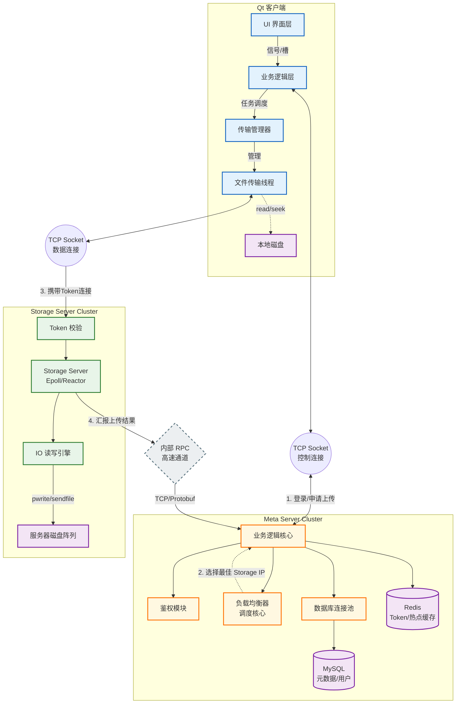

```mermaid
graph TD
    %% =======================
    %% 客户端区域
    %% =======================
    subgraph Client_Side [Qt 客户端]
        UI[UI 界面层]
        Logic[业务逻辑层]
        TransferMgr[传输管理器]
        FileWorker[文件传输线程]
        LocalDisk[本地磁盘]
        
        %% 客户端内部连接
        UI -->|信号/槽| Logic
        Logic -->|任务调度| TransferMgr
        TransferMgr -->|管理| FileWorker
        FileWorker -.->|read/seek| LocalDisk
    end

    %% =======================
    %% 网络连接层
    %% =======================
    MetaSocket((TCP Socket<br>控制连接))
    DataSocket((TCP Socket<br>数据连接))
    InternalNet{内部 RPC<br>高速通道}

    Logic <--> MetaSocket
    FileWorker <--> DataSocket

    %% =======================
    %% 服务端 - 控制平面
    %% =======================
    subgraph Control_Plane [Meta Server Cluster]
        MetaCore[业务逻辑核心]
        Auth[鉴权模块]
        LoadBalancer[负载均衡器<br>调度核心]
        DB_Pool[数据库连接池]
        
        %% 存储组件
        MySQL[(MySQL<br>元数据/用户)]
        Redis[(Redis<br>Token/热点缓存)]
        
        %% 控制面连接
        MetaCore --> Auth
        MetaCore --> LoadBalancer
        MetaCore --> DB_Pool
        MetaCore --> Redis
        DB_Pool --> MySQL
    end

    %% =======================
    %% 服务端 - 数据平面
    %% =======================
    subgraph Data_Plane [Storage Server Cluster]
        StorageCore[Storage Server<br>Epoll/Reactor]
        IO_Engine[IO 读写引擎]
        TokenCheck[Token 校验]
        
        StorageCore --> IO_Engine
        IO_Engine -->|pwrite/sendfile| ServerDisk[服务器磁盘阵列]
    end

    %% =======================
    %% 交互流程
    %% =======================
    %% 1. 控制流
    MetaSocket <-->|1. 登录/申请上传| MetaCore
    
    %% 2. 调度流 (LB介入)
    LoadBalancer -.->|2. 选择最佳 Storage IP| MetaCore
    
    %% 3. 数据流
    DataSocket -->|3. 携带Token连接| TokenCheck
    TokenCheck --> StorageCore
    
    %% 4. 内部汇报流 (解耦关键)
    StorageCore -->|4. 汇报上传结果| InternalNet
    InternalNet -->|TCP/Protobuf| MetaCore

    %% 样式定义
    classDef client fill:#e3f2fd,stroke:#1565c0,stroke-width:2px;
    classDef control fill:#fff8e1,stroke:#ff6f00,stroke-width:2px;
    classDef data fill:#e8f5e9,stroke:#2e7d32,stroke-width:2px;
    classDef storage fill:#f3e5f5,stroke:#7b1fa2,stroke-width:2px;
    classDef net fill:#eceff1,stroke:#546e7a,stroke-width:2px,stroke-dasharray: 5 5;

    class UI,Logic,TransferMgr,FileWorker client;
    class MetaCore,Auth,LoadBalancer,DB_Pool control;
    class StorageCore,IO_Engine,TokenCheck data;
    class MySQL,Redis,ServerDisk,LocalDisk storage;
    class InternalNet net;
```