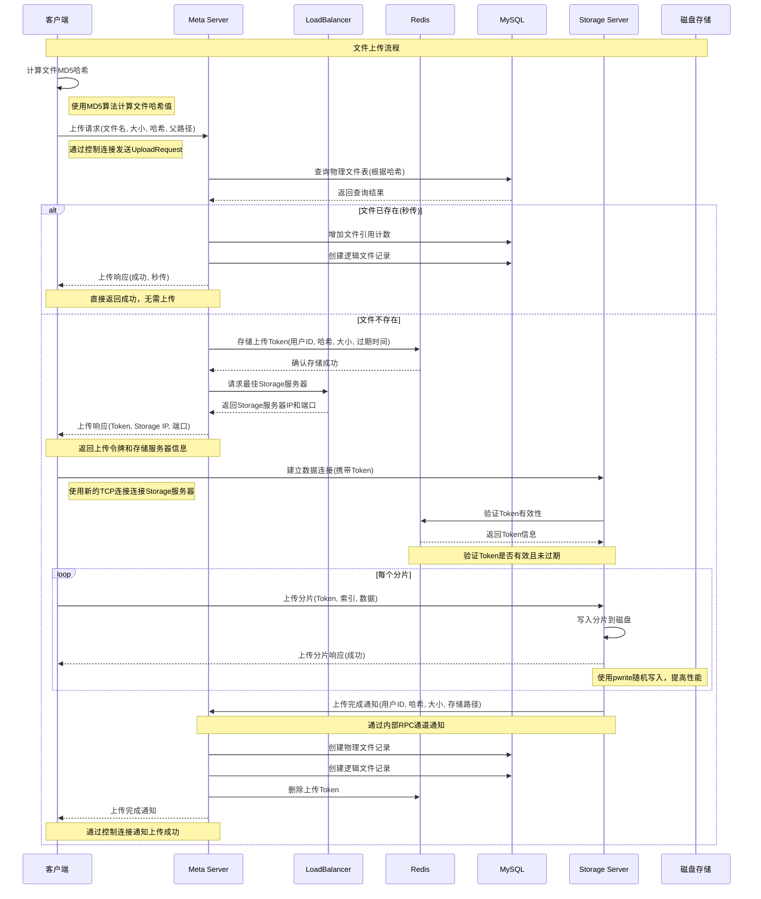
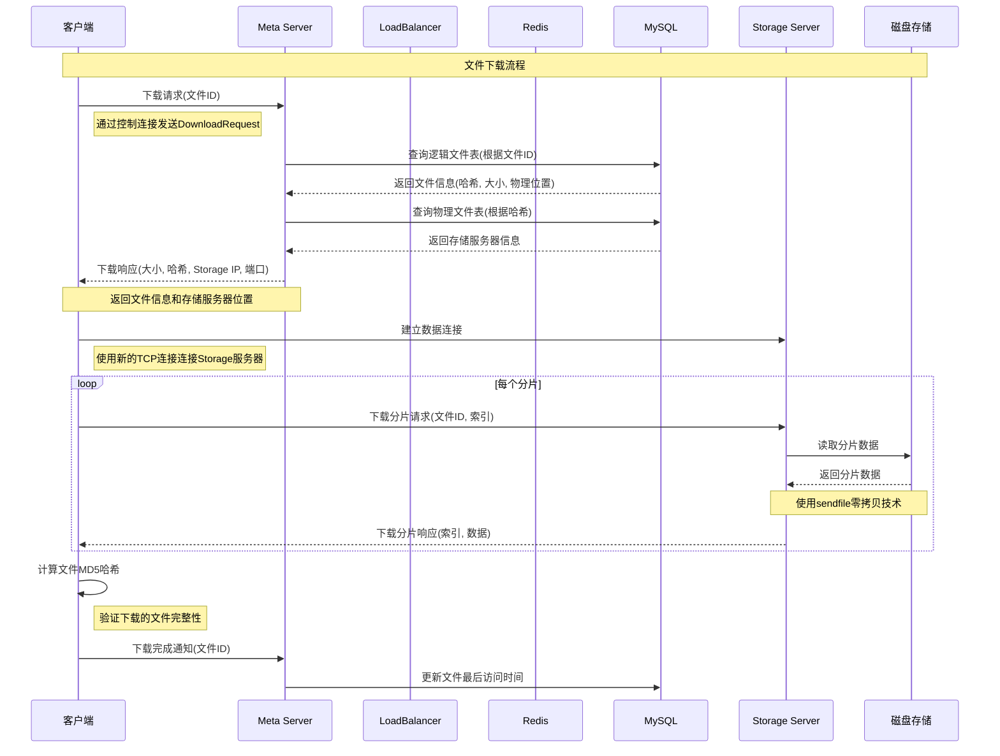
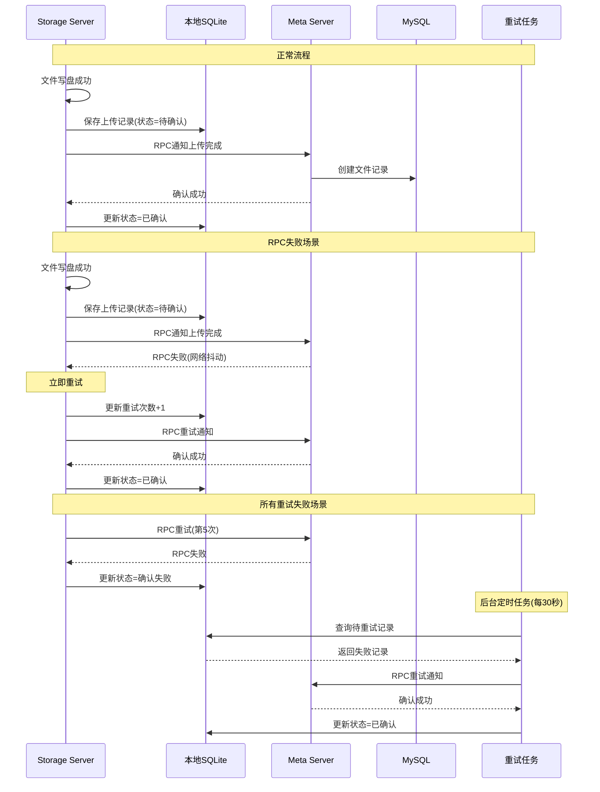
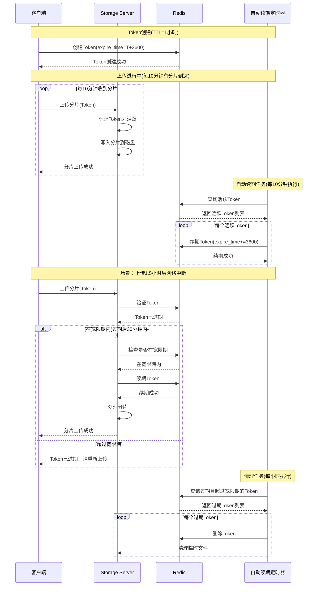
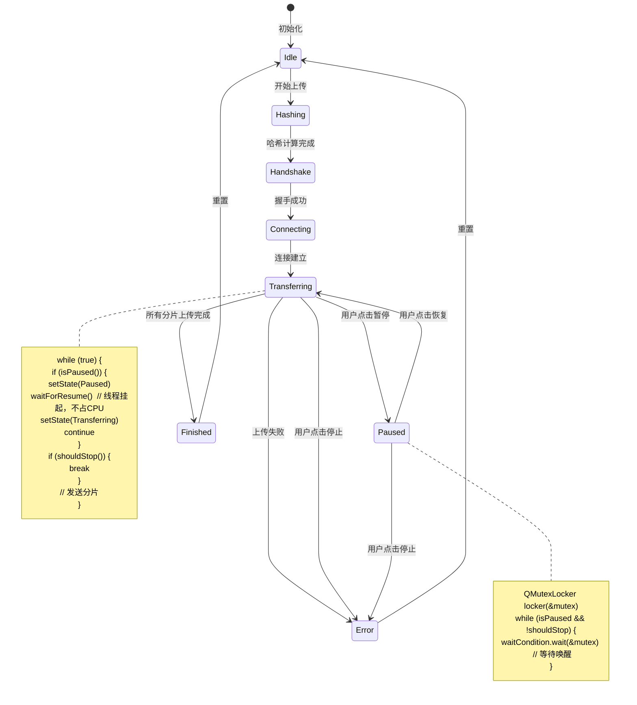

# 聊天与文件传输系统重构技术详细设计文档

## 1. 项目目录结构设计

```
ChatAndFileTransferSystem/
├── Common/                           # 公共协议/工具库
│   ├── Protocol/                     # 通信协议定义
│   │   ├── TransHeader.h            # 定长包头结构
│   │   ├── CommandTypes.h           # 命令字枚举
│   │   ├── ClientProtocol.h         # 客户端-服务器协议
│   │   ├── InternalProtocol.h       # 内部RPC协议
│   │   └── CMakeLists.txt
│   ├── Utils/                       # 通用工具类
│   │   ├── HashUtil.h               # MD5/SHA256计算
│   │   ├── StringUtil.h             # 字符串处理
│   │   ├── FileUtil.h              # 文件操作工具
│   │   └── TimeUtil.h              # 时间处理工具
│   └── CMakeLists.txt
├── MetaServer/                       # Qt控制层
│   ├── Core/                        # 核心业务逻辑
│   │   ├── MetaServer.h/.cpp        # 主服务器类
│   │   ├── AuthModule.h/.cpp        # 认证模块
│   │   ├── LoadBalancer.h/.cpp       # 负载均衡器
│   │   └── FileMetaMgr.h/.cpp       # 文件元数据管理
│   ├── Database/                     # 数据库操作
│   │   ├── DatabaseManager.h/.cpp    # 数据库连接管理
│   │   ├── UserDAO.h/.cpp          # 用户数据访问对象
│   │   ├── FileDAO.h/.cpp          # 文件数据访问对象
│   │   └── CMakeLists.txt
│   ├── Network/                     # 网络通信
│   │   ├── TcpServer.h/.cpp         # TCP服务器
│   │   ├── ClientConnection.h/.cpp   # 客户端连接
│   │   └── CMakeLists.txt
│   ├── Cache/                       # 缓存管理
│   │   ├── RedisManager.h/.cpp       # Redis连接管理
│   │   └── CMakeLists.txt
│   ├── UI/                          # 用户界面
│   │   ├── ServerWindow.h/.cpp/.ui   # 服务器监控界面
│   │   └── CMakeLists.txt
│   ├── Config/                      # 配置管理
│   │   ├── ServerConfig.h/.cpp       # 服务器配置
│   │   └── CMakeLists.txt
│   ├── main.cpp                     # 主函数入口
│   └── CMakeLists.txt
├── StorageServer/                    # C++ Epoll数据层
│   ├── Core/                        # 核心业务逻辑
│   │   ├── StorageServer.h/.cpp      # 主存储服务器
│   │   ├── TokenValidator.h/.cpp     # Token验证器
│   │   └── StorageEngine.h/.cpp     # 存储引擎
│   ├── Network/                     # 网络通信
│   │   ├── TcpServer.h/.cpp         # Epoll封装的TCP服务器
│   │   ├── Connection.h/.cpp         # 连接管理
│   │   ├── ConnectionPool.h/.cpp     # 连接池
│   │   └── CMakeLists.txt
│   ├── IO/                          # IO操作
│   │   ├── FileReader.h/.cpp         # 文件读取
│   │   ├── FileWriter.h/.cpp         # 文件写入
│   │   └── CMakeLists.txt
│   ├── RPC/                         # 内部RPC通信
│   │   ├── RPCClient.h/.cpp          # RPC客户端(向Meta汇报)
│   │   ├── RPCServer.h/.cpp          # RPC服务器(接收Meta指令)
│   │   └── CMakeLists.txt
│   ├── Config/                      # 配置管理
│   │   ├── StorageConfig.h/.cpp       # 存储服务器配置
│   │   └── CMakeLists.txt
│   ├── main.cpp                     # 主函数入口
│   └── CMakeLists.txt
├── Client/                          # Qt客户端
│   ├── Core/                        # 核心业务逻辑
│   │   ├── ClientCore.h/.cpp         # 客户端核心
│   │   ├── TransferManager.h/.cpp     # 传输管理器
│   │   └── FileWorker.h/.cpp        # 文件传输线程
│   ├── Network/                     # 网络通信
│   │   ├── NetworkManager.h/.cpp     # 网络管理器
│   │   ├── MetaConnection.h/.cpp      # Meta服务器连接
│   │   ├── StorageConnection.h/.cpp   # Storage服务器连接
│   │   └── CMakeLists.txt
│   ├── UI/                          # 用户界面
│   │   ├── MainWindow.h/.cpp/.ui    # 主窗口
│   │   ├── LoginDialog.h/.cpp/.ui    # 登录对话框
│   │   ├── ChatWidget.h/.cpp/.ui     # 聊天界面
│   │   ├── FileWidget.h/.cpp/.ui     # 文件管理界面
│   │   └── CMakeLists.txt
│   ├── Models/                      # 数据模型
│   │   ├── UserModel.h/.cpp         # 用户模型
│   │   ├── FileModel.h/.cpp         # 文件模型
│   │   └── CMakeLists.txt
│   ├── Utils/                       # 客户端工具
│   │   ├── ConfigManager.h/.cpp       # 配置管理
│   │   └── CMakeLists.txt
│   ├── main.cpp                     # 主函数入口
│   └── CMakeLists.txt
├── Tests/                           # 测试代码
│   ├── UnitTests/                   # 单元测试
│   ├── IntegrationTests/            # 集成测试
│   └── CMakeLists.txt
├── Docs/                            # 文档
│   ├── API.md                      # API文档
│   ├── Deployment.md                # 部署文档
│   └── Architecture.md             # 架构文档
├── Scripts/                         # 脚本
│   ├── build.sh                    # 构建脚本
│   ├── deploy.sh                   # 部署脚本
│   └── test.sh                     # 测试脚本
├── CMakeLists.txt                   # 主CMake文件
└── README.md                        # 项目说明
```

---

## 2. 数据库与缓存设计 (Schema Design)

### 2.1 MySQL 表设计 (Meta Server)

#### 用户表 (t_user)
```sql
CREATE TABLE `t_user` (
  `id` BIGINT UNSIGNED NOT NULL AUTO_INCREMENT COMMENT '用户ID',
  `username` VARCHAR(64) NOT NULL COMMENT '用户名',
  `password_hash` VARCHAR(128) NOT NULL COMMENT '密码哈希',
  `salt` VARCHAR(32) NOT NULL COMMENT '密码盐值',
  `nickname` VARCHAR(64) DEFAULT '' COMMENT '昵称',
  `avatar_url` VARCHAR(255) DEFAULT '' COMMENT '头像URL',
  `status` TINYINT NOT NULL DEFAULT 0 COMMENT '状态：0-离线，1-在线，2-隐身',
  `create_time` DATETIME NOT NULL DEFAULT CURRENT_TIMESTAMP COMMENT '创建时间',
  `update_time` DATETIME NOT NULL DEFAULT CURRENT_TIMESTAMP ON UPDATE CURRENT_TIMESTAMP COMMENT '更新时间',
  PRIMARY KEY (`id`),
  UNIQUE KEY `uk_username` (`username`),
  KEY `idx_status` (`status`)
) ENGINE=InnoDB DEFAULT CHARSET=utf8mb4 COMMENT='用户表';
```

#### 逻辑文件表 (t_file_info)
```sql
CREATE TABLE `t_file_info` (
  `id` BIGINT UNSIGNED NOT NULL AUTO_INCREMENT COMMENT '文件ID',
  `user_id` BIGINT UNSIGNED NOT NULL COMMENT '用户ID',
  `file_name` VARCHAR(255) NOT NULL COMMENT '文件名',
  `file_path` VARCHAR(512) NOT NULL COMMENT '文件路径(相对路径)',
  `file_size` BIGINT UNSIGNED NOT NULL DEFAULT 0 COMMENT '文件大小(字节)',
  `file_hash` VARCHAR(64) DEFAULT '' COMMENT '文件哈希值(MD5)',
  `file_type` TINYINT NOT NULL DEFAULT 0 COMMENT '文件类型：0-文件，1-目录',
  `parent_id` BIGINT UNSIGNED DEFAULT 0 COMMENT '父目录ID，0表示根目录',
  `is_deleted` TINYINT NOT NULL DEFAULT 0 COMMENT '是否已删除：0-未删除，1-已删除',
  `create_time` DATETIME NOT NULL DEFAULT CURRENT_TIMESTAMP COMMENT '创建时间',
  `update_time` DATETIME NOT NULL DEFAULT CURRENT_TIMESTAMP ON UPDATE CURRENT_TIMESTAMP COMMENT '更新时间',
  PRIMARY KEY (`id`),
  KEY `idx_user_id` (`user_id`),
  KEY `idx_parent_id` (`parent_id`),
  KEY `idx_file_hash` (`file_hash`),
  FOREIGN KEY (`user_id`) REFERENCES `t_user` (`id`) ON DELETE CASCADE
) ENGINE=InnoDB DEFAULT CHARSET=utf8mb4 COMMENT='逻辑文件表';
```

#### 物理文件表 (t_file_store)
```sql
CREATE TABLE `t_file_store` (
  `id` BIGINT UNSIGNED NOT NULL AUTO_INCREMENT COMMENT '物理文件ID',
  `file_hash` VARCHAR(64) NOT NULL COMMENT '文件哈希值(MD5)',
  `file_size` BIGINT UNSIGNED NOT NULL COMMENT '文件大小(字节)',
  `storage_path` VARCHAR(512) NOT NULL COMMENT '物理存储路径',
  `storage_server_id` INT UNSIGNED NOT NULL COMMENT '存储服务器ID',
  `ref_count` INT UNSIGNED NOT NULL DEFAULT 1 COMMENT '引用计数',
  `first_upload_time` DATETIME NOT NULL DEFAULT CURRENT_TIMESTAMP COMMENT '首次上传时间',
  `last_access_time` DATETIME NOT NULL DEFAULT CURRENT_TIMESTAMP ON UPDATE CURRENT_TIMESTAMP COMMENT '最后访问时间',
  PRIMARY KEY (`id`),
  UNIQUE KEY `uk_file_hash` (`file_hash`),
  KEY `idx_storage_server` (`storage_server_id`),
  KEY `idx_ref_count` (`ref_count`)
) ENGINE=InnoDB DEFAULT CHARSET=utf8mb4 COMMENT='物理文件表';
```

#### 存储服务器表 (t_storage_server)
```sql
CREATE TABLE `t_storage_server` (
  `id` INT UNSIGNED NOT NULL AUTO_INCREMENT COMMENT '服务器ID',
  `server_name` VARCHAR(64) NOT NULL COMMENT '服务器名称',
  `ip_address` VARCHAR(45) NOT NULL COMMENT 'IP地址',
  `port` SMALLINT UNSIGNED NOT NULL COMMENT '端口',
  `status` TINYINT NOT NULL DEFAULT 0 COMMENT '状态：0-离线，1-在线，2-维护中',
  `capacity_total` BIGINT UNSIGNED NOT NULL DEFAULT 0 COMMENT '总容量(字节)',
  `capacity_used` BIGINT UNSIGNED NOT NULL DEFAULT 0 COMMENT '已用容量(字节)',
  `weight` INT UNSIGNED NOT NULL DEFAULT 1 COMMENT '负载均衡权重',
  `create_time` DATETIME NOT NULL DEFAULT CURRENT_TIMESTAMP COMMENT '创建时间',
  `update_time` DATETIME NOT NULL DEFAULT CURRENT_TIMESTAMP ON UPDATE CURRENT_TIMESTAMP COMMENT '更新时间',
  PRIMARY KEY (`id`),
  UNIQUE KEY `uk_ip_port` (`ip_address`, `port`)
) ENGINE=InnoDB DEFAULT CHARSET=utf8mb4 COMMENT='存储服务器表';
```

### 2.2 Redis Key 设计

#### 上传Token
```
Key格式: upload_token:{token}
Value结构: JSON {
    "user_id": 12345,
    "file_hash": "d41d8cd98f00b204e9800998ecf8427e",
    "file_size": 1048576,
    "file_name": "example.txt",
    "expire_time": 1640995200
}
TTL: 1小时 (3600秒)
```

#### Storage Server状态上报
```
Key格式: storage_status:{server_id}
Value结构: JSON {
    "status": "online",
    "cpu_usage": 45.2,
    "memory_usage": 68.5,
    "disk_usage": 78.9,
    "network_io": 1024000,
    "active_connections": 256,
    "last_heartbeat": 1640995200
}
TTL: 5分钟 (300秒)
```

#### 用户会话信息
```
Key格式: user_session:{user_id}
Value结构: JSON {
    "login_time": 1640995200,
    "last_active": 1640998800,
    "client_ip": "192.168.1.100",
    "token": "abc123def456"
}
TTL: 24小时 (86400秒)
```

#### 在线用户列表
```
Key格式: online_users
Value结构: SET {
    "user_id:12345",
    "user_id:12346",
    ...
}
TTL: 无限制
```

---

## 3. 通信协议规范 (Protocol Specification)

### 3.1 定长包头结构

```cpp
#pragma pack(push, 1)  // 确保无内存对齐

/**
 * @brief 定长包头结构，用于解决粘包问题
 */
struct TransHeader {
    uint32_t magic;        // 魔数，用于校验包的完整性 (固定值: 0x12345678)
    uint32_t cmd;          // 命令字，对应CommandType枚举
    uint32_t seq;          // 序列号，用于请求响应匹配
    uint32_t len;          // 包体长度(不包含包头)
    uint32_t checksum;     // 校验和，用于验证包完整性
    uint32_t reserved;     // 保留字段，未来扩展
};

/**
 * @brief 命令字枚举
 */
enum CommandType : uint32_t {
    // 控制平面命令 (Client <-> Meta Server)
    CMD_LOGIN_REQ = 0x1001,          // 登录请求
    CMD_LOGIN_RES = 0x1002,           // 登录响应
    CMD_LOGOUT_REQ = 0x1003,          // 登出请求
    CMD_LOGOUT_RES = 0x1004,          // 登出响应
    
    CMD_CHAT_REQ = 0x1011,            // 聊天请求
    CMD_CHAT_RES = 0x1012,            // 聊天响应
    CMD_CHAT_NOTIFY = 0x1013,         // 聊天通知
    
    CMD_UPLOAD_REQ = 0x1021,          // 申请上传
    CMD_UPLOAD_RES = 0x1022,           // 上传申请响应
    CMD_DOWNLOAD_REQ = 0x1023,        // 申请下载
    CMD_DOWNLOAD_RES = 0x1024,        // 下载申请响应
    
    CMD_FILE_LIST_REQ = 0x1031,       // 文件列表请求
    CMD_FILE_LIST_RES = 0x1032,       // 文件列表响应
    CMD_DELETE_FILE_REQ = 0x1033,     // 删除文件请求
    CMD_DELETE_FILE_RES = 0x1034,     // 删除文件响应
    CMD_RENAME_FILE_REQ = 0x1035,     // 重命名文件请求
    CMD_RENAME_FILE_RES = 0x1036,     // 重命名文件响应
    
    // 数据平面命令 (Client <-> Storage Server)
    CMD_UPLOAD_CHUNK_REQ = 0x2001,    // 上传分片请求
    CMD_UPLOAD_CHUNK_RES = 0x2002,     // 上传分片响应
    CMD_DOWNLOAD_CHUNK_REQ = 0x2003,  // 下载分片请求
    CMD_DOWNLOAD_CHUNK_RES = 0x2004,  // 下载分片响应
    
    // 内部RPC命令 (Meta Server <-> Storage Server)
    CMD_INTERNAL_HEARTBEAT = 0x3001,  // 心跳检测
    CMD_INTERNAL_STATUS_REPORT = 0x3002, // 状态上报
    CMD_INTERNAL_UPLOAD_COMPLETE = 0x3003, // 上传完成通知
    CMD_INTERNAL_DELETE_FILE = 0x3004,  // 删除物理文件
};

#pragma pack(pop)  // 恢复默认内存对齐
```

### 3.2 核心包体结构

```cpp
/**
 * @brief 登录请求
 */
struct LoginReq {
    char username[64];     // 用户名
    char password_hash[128]; // 密码哈希
    char client_version[16]; // 客户端版本
};

/**
 * @brief 登录响应
 */
struct LoginRes {
    uint32_t result_code;  // 结果码：0-成功，非0-错误码
    uint64_t user_id;      // 用户ID
    char nickname[64];     // 昵称
    char session_token[64]; // 会话令牌
    char error_msg[256];    // 错误信息
};

/**
 * @brief 上传请求
 */
struct UploadRequest {
    uint64_t user_id;      // 用户ID
    char file_name[256];   // 文件名
    uint64_t file_size;    // 文件大小
    char file_hash[64];    // 文件MD5哈希
    char parent_path[512]; // 父目录路径
    uint32_t chunk_size;   // 分片大小
};

/**
 * @brief 上传响应
 */
struct UploadResponse {
    uint32_t result_code;  // 结果码：0-成功，非0-错误码
    char upload_token[64]; // 上传令牌
    char storage_ip[45];   // 存储服务器IP
    uint16_t storage_port; // 存储服务器端口
    uint32_t chunk_size;  // 建议分片大小
    char error_msg[256];  // 错误信息
};

/**
 * @brief 文件分片数据包
 */
struct UploadChunk {
    char upload_token[64]; // 上传令牌
    uint32_t chunk_index; // 分片索引
    uint32_t chunk_size;  // 分片大小
    char chunk_data[];     // 分片数据(柔性数组)
};

/**
 * @brief 下载请求
 */
struct DownloadRequest {
    uint64_t user_id;      // 用户ID
    uint64_t file_id;      // 文件ID
    uint32_t chunk_size;   // 请求分片大小
};

/**
 * @brief 下载响应
 */
struct DownloadResponse {
    uint32_t result_code;  // 结果码：0-成功，非0-错误码
    uint64_t file_size;    // 文件大小
    char file_hash[64];    // 文件MD5哈希
    char storage_ip[45];   // 存储服务器IP
    uint16_t storage_port; // 存储服务器端口
    uint32_t chunk_size;  // 建议分片大小
    char error_msg[256];  // 错误信息
};

/**
 * @brief 下载分片数据包
 */
struct DownloadChunk {
    uint64_t file_id;      // 文件ID
    uint32_t chunk_index; // 分片索引
    uint32_t chunk_size;  // 分片大小
    char chunk_data[];     // 分片数据(柔性数组)
};
```

### 3.3 内部RPC协议结构

```cpp
/**
 * @brief 心跳包
 */
struct Heartbeat {
    uint64_t timestamp;    // 时间戳
    uint32_t server_id;    // 服务器ID
    uint32_t status;       // 状态：0-正常，1-异常
};

/**
 * @brief 状态上报
 */
struct StatusReport {
    uint64_t timestamp;    // 时间戳
    uint32_t server_id;    // 服务器ID
    float cpu_usage;       // CPU使用率(百分比)
    float memory_usage;    // 内存使用率(百分比)
    float disk_usage;      // 磁盘使用率(百分比)
    uint64_t network_in;   // 网络入流量(字节)
    uint64_t network_out;  // 网络出流量(字节)
    uint32_t connections;   // 当前连接数
};

/**
 * @brief 上传完成通知
 */
struct UploadComplete {
    uint64_t user_id;      // 用户ID
    char file_hash[64];    // 文件哈希
    uint64_t file_size;    // 文件大小
    char storage_path[512]; // 存储路径
    uint32_t server_id;    // 存储服务器ID
    uint64_t timestamp;    // 完成时间戳
};

/**
 * @brief 删除物理文件请求
 */
struct DeletePhysicalFile {
    char file_hash[64];    // 文件哈希
    uint32_t server_id;    // 存储服务器ID
};
```

---

## 4. 核心类结构设计 (Class Hierarchy)

### 4.1 Client端核心类

```cpp
/**
 * @brief 文件传输工作线程
 */
class FileWorker : public QObject {
    Q_OBJECT
public:
    explicit FileWorker(QObject* parent = nullptr);
    ~FileWorker();
    
    // 上传文件
    void uploadFile(const QString& filePath, const QString& parentPath);
    // 下载文件
    void downloadFile(uint64_t fileId, const QString& savePath);
    // 停止传输
    void stopTransfer();
    
signals:
    // 上传进度
    void uploadProgress(const QString& filePath, qint64 bytesSent, qint64 bytesTotal);
    // 上传完成
    void uploadFinished(const QString& filePath, bool success, const QString& errorMsg);
    // 下载进度
    void downloadProgress(uint64_t fileId, qint64 bytesReceived, qint64 bytesTotal);
    // 下载完成
    void downloadFinished(uint64_t fileId, bool success, const QString& errorMsg);
    
private slots:
    void onUploadChunkAcked(uint32_t chunkIndex);
    void onDownloadChunkReceived(uint32_t chunkIndex, const QByteArray& data);
    
private:
    // 计算文件哈希
    QString calculateFileHash(const QString& filePath);
    // 分割文件为分片
    QList<QByteArray> splitFileToChunks(const QString& filePath, uint32_t chunkSize);
    // 发送分片
    void sendChunk(const QByteArray& chunk, uint32_t chunkIndex);
    
    QString m_filePath;                    // 当前处理的文件路径
    uint64_t m_fileSize;                   // 文件大小
    QString m_fileHash;                    // 文件哈希
    QString m_uploadToken;                 // 上传令牌
    QString m_storageIp;                   // 存储服务器IP
    uint16_t m_storagePort;                // 存储服务器端口
    QAtomicInt m_nextChunkIndex;           // 下一个要发送的分片索引
    QAtomicBool m_isUploading;             // 是否正在上传
    QAtomicBool m_shouldStop;              // 是否应该停止
    QTimer* m_heartbeatTimer;             // 心跳定时器
};

/**
 * @brief 网络管理器
 */
class NetworkManager : public QObject {
    Q_OBJECT
public:
    explicit NetworkManager(QObject* parent = nullptr);
    ~NetworkManager();
    
    // 连接到Meta服务器
    bool connectToMetaServer(const QString& ip, uint16_t port);
    // 连接到Storage服务器
    bool connectToStorageServer(const QString& ip, uint16_t port);
    // 断开连接
    void disconnectFromServer();
    
    // 发送消息到Meta服务器
    bool sendToMetaServer(const TransHeader& header, const QByteArray& data);
    // 发送消息到Storage服务器
    bool sendToStorageServer(const TransHeader& header, const QByteArray& data);
    
    // 获取连接状态
    bool isMetaServerConnected() const;
    bool isStorageServerConnected() const;
    
signals:
    // Meta服务器连接状态变化
    void metaServerConnectionChanged(bool connected);
    // Storage服务器连接状态变化
    void storageServerConnectionChanged(bool connected);
    // 收到Meta服务器消息
    void metaServerMessageReceived(const TransHeader& header, const QByteArray& data);
    // 收到Storage服务器消息
    void storageServerMessageReceived(const TransHeader& header, const QByteArray& data);
    
private slots:
    void onMetaSocketReadyRead();
    void onStorageSocketReadyRead();
    void onSocketError(QAbstractSocket::SocketError error);
    
private:
    // 处理接收到的数据
    void processReceivedData(QTcpSocket* socket, QByteArray& buffer);
    
    QTcpSocket* m_metaSocket;              // Meta服务器连接
    QTcpSocket* m_storageSocket;          // Storage服务器连接
    QByteArray m_metaBuffer;               // Meta服务器接收缓冲区
    QByteArray m_storageBuffer;            // Storage服务器接收缓冲区
    QAtomicInt m_sequenceNumber;           // 序列号生成器
};

/**
 * @brief 传输管理器
 */
class TransferManager : public QObject {
    Q_OBJECT
public:
    explicit TransferManager(QObject* parent = nullptr);
    ~TransferManager();
    
    // 申请上传文件
    void requestUpload(const QString& filePath, const QString& parentPath);
    // 申请下载文件
    void requestDownload(uint64_t fileId, const QString& savePath);
    
    // 获取传输状态
    bool isTransferring() const;
    qint64 getTransferSpeed() const;
    
signals:
    // 上传进度
    void uploadProgress(const QString& filePath, qint64 bytesSent, qint64 bytesTotal);
    // 上传完成
    void uploadFinished(const QString& filePath, bool success, const QString& errorMsg);
    // 下载进度
    void downloadProgress(uint64_t fileId, qint64 bytesReceived, qint64 bytesTotal);
    // 下载完成
    void downloadFinished(uint64_t fileId, bool success, const QString& errorMsg);
    
public slots:
    // 处理上传响应
    void handleUploadResponse(const TransHeader& header, const QByteArray& data);
    // 处理下载响应
    void handleDownloadResponse(const TransHeader& header, const QByteArray& data);
    
private:
    NetworkManager* m_networkManager;      // 网络管理器
    FileWorker* m_fileWorker;             // 文件工作线程
    QThread* m_workerThread;              // 工作线程
    QAtomicBool m_isTransferring;         // 是否正在传输
    QAtomicInt m_activeTransfers;         // 活跃传输数量
    QTimer* m_speedTimer;                 // 速度计算定时器
    qint64 m_lastBytesTransferred;        // 上次计算的传输字节数
    qint64 m_transferSpeed;               // 当前传输速度(字节/秒)
};
```

### 4.2 Meta Server核心类

```cpp
/**
 * @brief 负载均衡器
 */
class LoadBalancer : public QObject {
    Q_OBJECT
public:
    explicit LoadBalancer(QObject* parent = nullptr);
    ~LoadBalancer();
    
    // 添加存储服务器
    bool addStorageServer(uint32_t serverId, const QString& ip, uint16_t port, int weight = 1);
    // 移除存储服务器
    bool removeStorageServer(uint32_t serverId);
    // 更新服务器状态
    bool updateServerStatus(uint32_t serverId, float cpuUsage, float memoryUsage, 
                         float diskUsage, uint32_t connections);
    
    // 选择最佳存储服务器
    uint32_t selectBestServer(uint64_t fileSize = 0);
    // 获取服务器信息
    bool getServerInfo(uint32_t serverId, QString& ip, uint16_t& port) const;
    
    // 获取所有在线服务器
    QList<uint32_t> getOnlineServers() const;
    
signals:
    // 服务器状态变化
    void serverStatusChanged(uint32_t serverId, bool online);
    
private:
    struct ServerInfo {
        uint32_t serverId;
        QString ip;
        uint16_t port;
        int weight;
        bool online;
        float cpuUsage;
        float memoryUsage;
        float diskUsage;
        uint32_t connections;
        uint64_t lastHeartbeat;
    };
    
    // 计算服务器负载分数
    float calculateLoadScore(const ServerInfo& server, uint64_t fileSize) const;
    // 检查服务器是否在线
    bool isServerOnline(const ServerInfo& server) const;
    
    QMap<uint32_t, ServerInfo> m_servers;  // 服务器信息映射
    QMutex m_mutex;                        // 互斥锁
    QTimer* m_heartbeatTimer;               // 心跳检查定时器
};

/**
 * @brief 文件元数据管理器
 */
class FileMetaMgr : public QObject {
    Q_OBJECT
public:
    explicit FileMetaMgr(QObject* parent = nullptr);
    ~FileMetaMgr();
    
    // 检查文件是否已存在(秒传)
    bool checkFileExists(const QString& fileHash, uint64_t fileSize, QString& storagePath);
    
    // 创建文件记录
    uint64_t createFileRecord(uint64_t userId, const QString& fileName, 
                           const QString& filePath, uint64_t fileSize, 
                           const QString& fileHash, uint64_t parentId = 0);
    
    // 获取用户文件列表
    QList<FileMetaInfo> getUserFiles(uint64_t userId, uint64_t parentId = 0);
    
    // 删除文件记录
    bool deleteFileRecord(uint64_t userId, uint64_t fileId);
    
    // 重命名文件
    bool renameFile(uint64_t userId, uint64_t fileId, const QString& newName);
    
    // 移动文件
    bool moveFile(uint64_t userId, uint64_t fileId, uint64_t newParentId);
    
    // 获取文件信息
    FileMetaInfo getFileInfo(uint64_t fileId);
    
    // 增加文件引用计数
    bool increaseFileRef(const QString& fileHash);
    // 减少文件引用计数
    bool decreaseFileRef(const QString& fileHash);
    
signals:
    // 文件记录变化
    void fileRecordChanged(uint64_t userId, uint64_t fileId);
    
private:
    DatabaseManager* m_dbManager;          // 数据库管理器
    RedisManager* m_redisManager;         // Redis管理器
    QMutex m_mutex;                       // 互斥锁
};

/**
 * @brief Meta服务器核心类
 */
class MetaServer : public QObject {
    Q_OBJECT
public:
    explicit MetaServer(QObject* parent = nullptr);
    ~MetaServer();
    
    // 启动服务器
    bool start(const QString& ip, uint16_t port);
    // 停止服务器
    void stop();
    
    // 获取服务器状态
    bool isRunning() const;
    
public slots:
    // 处理客户端连接
    void handleClientConnection();
    // 处理客户端消息
    void handleClientMessage(qintptr socketDescriptor, const TransHeader& header, const QByteArray& data);
    
    // 处理Storage服务器状态上报
    void handleStorageStatusReport(uint32_t serverId, const StatusReport& report);
    
    // 处理上传完成通知
    void handleUploadComplete(const UploadComplete& complete);
    
private:
    // 处理登录请求
    void handleLoginRequest(qintptr socketDescriptor, const LoginReq& req);
    // 处理上传请求
    void handleUploadRequest(qintptr socketDescriptor, const UploadRequest& req);
    // 处理下载请求
    void handleDownloadRequest(qintptr socketDescriptor, const DownloadRequest& req);
    // 处理文件列表请求
    void handleFileListRequest(qintptr socketDescriptor, uint64_t userId, uint64_t parentId);
    // 处理删除文件请求
    void handleDeleteFileRequest(qintptr socketDescriptor, uint64_t userId, uint64_t fileId);
    // 处理重命名文件请求
    void handleRenameFileRequest(qintptr socketDescriptor, uint64_t userId, uint64_t fileId, const QString& newName);
    
    // 生成上传令牌
    QString generateUploadToken(uint64_t userId, const QString& fileHash);
    
    TcpServer* m_tcpServer;               // TCP服务器
    AuthModule* m_authModule;              // 认证模块
    LoadBalancer* m_loadBalancer;          // 负载均衡器
    FileMetaMgr* m_fileMetaMgr;           // 文件元数据管理器
    RedisManager* m_redisManager;          // Redis管理器
    DatabaseManager* m_dbManager;         // 数据库管理器
    
    QMap<qintptr, ClientConnection*> m_connections; // 客户端连接映射
    QMutex m_mutex;                       // 互斥锁
    QAtomicBool m_running;                // 运行状态
};
```

### 4.3 Storage Server核心类

```cpp
/**
 * @brief TCP服务器(Epoll封装)
 */
class TcpServer : public QObject {
    Q_OBJECT
public:
    explicit TcpServer(QObject* parent = nullptr);
    ~TcpServer();
    
    // 启动服务器
    bool start(const QString& ip, uint16_t port);
    // 停止服务器
    void stop();
    
    // 获取服务器状态
    bool isRunning() const;
    // 获取连接数
    int getConnectionCount() const;
    
signals:
    // 新连接到达
    void newConnection(qintptr socketDescriptor);
    // 连接关闭
    void connectionClosed(qintptr socketDescriptor);
    // 收到消息
    void messageReceived(qintptr socketDescriptor, const TransHeader& header, const QByteArray& data);
    
private:
    // Epoll事件循环
    void eventLoop();
    // 处理新连接
    void handleNewConnection();
    // 处理连接关闭
    void handleConnectionClose(qintptr socketDescriptor);
    // 处理可读事件
    void handleReadableEvent(qintptr socketDescriptor);
    
    int m_epollFd;                        // Epoll文件描述符
    int m_listenFd;                       // 监听套接字
    QMap<qintptr, Connection*> m_connections; // 连接映射
    QThread* m_eventThread;               // 事件循环线程
    QAtomicBool m_running;                // 运行状态
    QMutex m_mutex;                       // 互斥锁
};

/**
 * @brief 连接管理
 */
class Connection : public QObject {
    Q_OBJECT
public:
    explicit Connection(qintptr socketDescriptor, QObject* parent = nullptr);
    ~Connection();
    
    // 获取套接字描述符
    qintptr socketDescriptor() const;
    
    // 发送数据
    bool sendData(const TransHeader& header, const QByteArray& data);
    
    // 获取接收缓冲区
    QByteArray& receiveBuffer();
    
    // 获取连接状态
    bool isConnected() const;
    
    // 关闭连接
    void close();
    
signals:
    // 收到完整消息
    void messageReceived(const TransHeader& header, const QByteArray& data);
    // 连接错误
    void errorOccurred(const QString& error);
    
private slots:
    void onSocketReadyRead();
    void onSocketError(QAbstractSocket::SocketError error);
    
private:
    // 处理接收到的数据
    void processReceivedData();
    
    qintptr m_socketDescriptor;            // 套接字描述符
    QTcpSocket* m_socket;                 // TCP套接字
    QByteArray m_receiveBuffer;            // 接收缓冲区
    QAtomicBool m_connected;               // 连接状态
    QMutex m_mutex;                       // 互斥锁
};

/**
 * @brief 存储引擎
 */
class StorageEngine : public QObject {
    Q_OBJECT
public:
    explicit StorageEngine(QObject* parent = nullptr);
    ~StorageEngine();
    
    // 初始化存储引擎
    bool initialize(const QString& basePath);
    
    // 写入文件分片
    bool writeChunk(const QString& filePath, uint32_t chunkIndex, 
                  const QByteArray& chunkData);
    
    // 读取文件分片
    QByteArray readChunk(const QString& filePath, uint32_t chunkIndex, 
                      uint32_t chunkSize);
    
    // 创建文件
    bool createFile(const QString& filePath, uint64_t fileSize);
    
    // 删除文件
    bool deleteFile(const QString& filePath);
    
    // 检查文件是否存在
    bool fileExists(const QString& filePath) const;
    
    // 获取文件大小
    uint64_t getFileSize(const QString& filePath) const;
    
    // 计算文件哈希
    QString calculateFileHash(const QString& filePath) const;
    
signals:
    // 写入进度
    void writeProgress(const QString& filePath, uint32_t chunkIndex, uint32_t totalChunks);
    // 写入完成
    void writeCompleted(const QString& filePath, bool success);
    
private:
    // 确保目录存在
    bool ensureDirectoryExists(const QString& dirPath) const;
    
    QString m_basePath;                    // 基础存储路径
    QMutex m_mutex;                       // 互斥锁
};

/**
 * @brief Token验证器
 */
class TokenValidator : public QObject {
    Q_OBJECT
public:
    explicit TokenValidator(QObject* parent = nullptr);
    ~TokenValidator();
    
    // 验证上传令牌
    bool validateUploadToken(const QString& token, uint64_t& userId, 
                          QString& fileHash, uint64_t& fileSize);
    
    // 生成上传令牌
    QString generateUploadToken(uint64_t userId, const QString& fileHash, 
                             uint64_t fileSize);
    
    // 清理过期令牌
    void cleanupExpiredTokens();
    
private:
    struct TokenInfo {
        uint64_t userId;
        QString fileHash;
        uint64_t fileSize;
        uint64_t expireTime;
    };
    
    QMap<QString, TokenInfo> m_tokens;    // 令牌映射
    QMutex m_mutex;                       // 互斥锁
    QTimer* m_cleanupTimer;                // 清理定时器
};

/**
 * @brief 存储服务器核心类
 */
class StorageServer : public QObject {
    Q_OBJECT
public:
    explicit StorageServer(QObject* parent = nullptr);
    ~StorageServer();
    
    // 启动服务器
    bool start(const QString& ip, uint16_t port);
    // 停止服务器
    void stop();
    
    // 获取服务器状态
    bool isRunning() const;
    
    // 设置服务器ID
    void setServerId(uint32_t serverId);
    
public slots:
    // 处理客户端消息
    void handleClientMessage(qintptr socketDescriptor, const TransHeader& header, const QByteArray& data);
    
    // 定期上报状态
    void reportStatus();
    
private:
    // 处理上传分片请求
    void handleUploadChunkRequest(qintptr socketDescriptor, const UploadChunk& req);
    // 处理下载分片请求
    void handleDownloadChunkRequest(qintptr socketDescriptor, const DownloadChunk& req);
    
    // 通知Meta服务器上传完成
    void notifyUploadComplete(const QString& token, const QString& filePath);
    
    TcpServer* m_tcpServer;               // TCP服务器
    TokenValidator* m_tokenValidator;      // Token验证器
    StorageEngine* m_storageEngine;       // 存储引擎
    RPCClient* m_rpcClient;               // RPC客户端(向Meta汇报)
    
    uint32_t m_serverId;                  // 服务器ID
    QString m_metaServerIp;               // Meta服务器IP
    uint16_t m_metaServerPort;            // Meta服务器端口
    
    QMap<qintptr, QString> m_uploadTokens; // 连接对应的上传令牌
    QMutex m_mutex;                       // 互斥锁
    QAtomicBool m_running;                // 运行状态
    QTimer* m_statusTimer;                // 状态上报定时器
};
```

---

## 5. 关键业务流程时序 (Sequence Flow)



### 5.1 文件下载流程时序



---

## 6. 风险应对方案 (Risk Mitigation)

### 6.1 内部RPC可靠性保障机制（防止僵尸文件）

#### 6.1.1 问题描述

Storage Server接收完文件并写盘成功后，需要通过内部RPC通知Meta Server更新数据库记录。如果此时网络抖动导致RPC发送失败，会出现以下问题：

- Storage Server认为"文件已存储"
- Meta Server认为"上传未完成"
- 结果：数据库无记录，文件变成"僵尸文件"（占用磁盘但无法访问）

#### 6.1.2 解决方案：多层次保障机制

**保障层次**：

1. **立即重试机制**：RPC失败后立即重试3次
2. **本地持久化**：将上传记录保存到本地SQLite数据库
3. **定时扫描重试**：后台任务每30秒扫描待确认记录并重试
4. **幂等性设计**：Meta Server记录已处理的通知，避免重复处理

#### 6.1.3 核心数据结构

```cpp
/**
 * @brief 上传完成通知（增强版，支持重试和幂等性）
 */
#pragma pack(push, 1)
struct UploadCompleteNotify {
    char upload_token[64];        // 上传令牌（唯一标识）
    uint64_t user_id;             // 用户ID
    char file_hash[64];           // 文件哈希
    uint64_t file_size;           // 文件大小
    char file_name[256];          // 文件名
    uint32_t server_id;           // 存储服务器ID
    char server_ip[45];           // 服务器IP
    uint16_t server_port;         // 服务器端口
    char storage_path[512];       // 物理存储路径
    uint32_t status;              // 状态：0-成功，1-部分失败
    uint32_t total_chunks;        // 总分片数
    uint32_t success_chunks;     // 成功分片数
    uint32_t failed_chunks;      // 失败分片数
    uint64_t upload_time;         // 上传完成时间戳
    uint64_t avg_speed;           // 平均速度（字节/秒）
    uint64_t start_time;          // 开始时间
    uint64_t end_time;            // 结束时间
    uint32_t retry_count;         // 重试次数（用于幂等性判断）
    uint32_t reserved;            // 保留字段
    char error_msg[256];          // 错误信息
};
#pragma pack(pop)

/**
 * @brief 本地上传记录（用于持久化）
 */
struct LocalUploadRecord {
    QString uploadToken;          // 上传令牌
    uint64_t userId;               // 用户ID
    QString fileHash;              // 文件哈希
    QString fileName;              // 文件名
    uint64_t fileSize;             // 文件大小
    QString storagePath;           // 存储路径
    uint64_t uploadTime;           // 上传时间
    uint32_t status;               // 状态：0-待确认，1-已确认，2-确认失败
    uint32_t retryCount;           // 重试次数
    uint64_t lastRetryTime;        // 最后重试时间
    QString errorMsg;              // 错误信息
};
```

#### 6.1.4 RPC客户端实现要点

```cpp
class RPCClient : public QObject {
    // 发送上传完成通知（带重试）
    bool notifyUploadComplete(const UploadCompleteNotify& notify);
    
    // 保存上传记录到本地数据库
    bool saveUploadRecord(const LocalUploadRecord& record);
    
    // 更新上传记录状态
    bool updateUploadRecordStatus(const QString& token, uint32_t status, 
                                  uint32_t retryCount, const QString& errorMsg);
    
    // 获取待重试的上传记录
    QList<LocalUploadRecord> getPendingRetryRecords();
    
    // 后台重试任务
    void retryPendingNotifications();
    
private:
    QSqlDatabase m_localDb;            // 本地SQLite数据库
    QTimer* m_retryTimer;               // 重试定时器（30秒）
    static const int MAX_RETRY_COUNT = 5;  // 最大重试次数
    static const int RETRY_INTERVAL_MS = 30000;  // 重试间隔30秒
};
```

#### 6.1.5 Meta Server幂等性处理

```cpp
class MetaRPCHandler : public QObject {
    // 检查是否重复通知（幂等性）
    bool isDuplicateNotification(const QString& token);
    
    // 记录已处理的通知
    void recordNotification(const QString& token);
    
    // 清理过期的通知记录
    void cleanupExpiredNotifications();
    
private:
    QMap<QString, uint64_t> m_processedNotifications;  // 已处理的通知
    QTimer* m_cleanupTimer;                            // 清理定时器（1小时）
};
```

#### 6.1.6 保障流程



### 6.2 Token续期机制（解决大文件上传超时问题）

#### 6.2.1 问题描述

- Token默认TTL为1小时
- 上传5GB文件可能需要2小时
- 上传到一半Token过期，导致传输中断

#### 6.2.2 解决方案：自动续期 + 宽限期机制

**续期策略**：

1. **自动续期**：每10分钟自动为活跃Token续期1小时
2. **宽限期**：Token过期后30分钟内仍可使用，但会触发续期
3. **最大续期次数**：限制为10次（最长10小时），防止恶意占用
4. **活跃标记**：每次收到分片时标记Token为活跃

#### 6.2.3 Token信息结构

```cpp
struct TokenInfo {
    uint64_t userId;
    QString fileHash;
    uint64_t fileSize;
    uint64_t createTime;      // 创建时间
    uint64_t expireTime;      // 过期时间
    uint64_t gracePeriodEnd;  // 宽限期结束时间（过期后额外30分钟）
    uint32_t renewCount;      // 续期次数
    uint64_t lastRenewTime;   // 最后续期时间
    bool isActive;            // 是否活跃（最近有分片到达）
};
```

#### 6.2.4 续期机制流程



#### 6.2.5 配置参数

```cpp
static const uint32_t DEFAULT_TTL = 3600;           // 默认TTL 1小时
static const uint32_t GRACE_PERIOD = 1800;         // 宽限期30分钟
static const uint32_t MAX_RENEW_COUNT = 10;        // 最大续期次数
static const uint32_t AUTO_RENEW_INTERVAL = 600;   // 自动续期间隔10分钟
```

### 6.3 简化负载均衡策略（第一版实现）

#### 6.3.1 问题描述

- 跨平台获取CPU/内存使用率复杂
- 第一版应简化实现，降低开发难度

#### 6.3.2 解决方案：基于连接数的加权轮询算法

**简化策略对比**：

| 策略 | 优点 | 缺点 | 适用场景 |
|------|------|------|----------|
| **加权轮询** | 实现简单，考虑服务器权重 | 不考虑实时负载 | 服务器性能差异明显 |
| **最少连接** | 考虑实时连接数，更均衡 | 可能导致请求集中到某台服务器 | 服务器性能相近 |
| **随机分配** | 实现最简单 | 不考虑负载 | 测试环境 |

**第一版推荐**：加权轮询（默认）+ 最少连接（备用）

#### 6.3.3 负载分数计算（简化版）

```cpp
float LoadBalancer::calculateLoadScore(const ServerInfo& server) const
{
    // 简化版：只考虑连接数
    // 负载分数 = 当前连接数 / (权重 * 最大连接数)
    // 分数越低，负载越轻
    
    if (!server.online) {
        return std::numeric_limits<float>::max();  // 离线服务器返回最大值
    }
    
    if (server.connections >= MAX_CONNECTIONS_PER_SERVER) {
        return std::numeric_limits<float>::max();  // 已满载
    }
    
    float maxConnections = server.weight * 100.0f;  // 权重*100作为基准
    float score = static_cast<float>(server.connections) / maxConnections;
    
    return score;
}
```

#### 6.3.4 加权轮询算法（平滑加权）

```cpp
uint32_t LoadBalancer::selectByWeightedRoundRobin()
{
    // 加权轮询算法（平滑加权）
    // 参考：nginx upstream round_robin 实现
    
    QList<uint32_t> onlineServers;
    int totalWeight = 0;
    
    for (auto it = m_servers.begin(); it != m_servers.end(); ++it) {
        const ServerInfo& server = it.value();
        if (server.online && server.connections < MAX_CONNECTIONS_PER_SERVER) {
            onlineServers.append(server.serverId);
            totalWeight += server.weight;
        }
    }
    
    if (onlineServers.isEmpty() || totalWeight == 0) {
        return 0;
    }
    
    // 平滑加权轮询
    m_currentWeight += totalWeight;
    
    uint32_t bestServer = 0;
    int maxCurrentWeight = -1;
    
    for (uint32_t serverId : onlineServers) {
        ServerInfo& server = m_servers[serverId];
        server.currentWeight += server.weight;
        
        if (server.currentWeight > maxCurrentWeight) {
            maxCurrentWeight = server.currentWeight;
            bestServer = serverId;
        }
    }
    
    if (bestServer != 0) {
        m_servers[bestServer].currentWeight -= m_currentWeight;
    }
    
    m_currentWeight = 0;
    
    return bestServer;
}
```

#### 6.3.5 配置参数

```cpp
static const uint32_t HEARTBEAT_TIMEOUT = 60000;          // 心跳超时60秒
static const uint32_t MAX_CONNECTIONS_PER_SERVER = 1000;  // 单服务器最大连接数
```

### 6.4 客户端传输状态机的暂停/恢复机制

#### 6.4.1 问题描述

- QThread中的while循环如何优雅暂停
- 避免CPU占用和死锁

#### 6.4.2 解决方案：条件变量 + 状态标志机制

**关键点**：

1. **条件变量**：`QWaitCondition::wait()` 会释放锁并挂起线程，不占用CPU
2. **互斥锁保护**：所有状态变量访问都通过互斥锁保护
3. **原子操作**：使用 `QAtomicBool` 和 `QAtomicInt` 避免竞态条件
4. **状态机清晰**：明确的状态转换，避免非法状态

#### 6.4.3 传输状态枚举

```cpp
enum TransferState {
    State_Idle = 0,           // 空闲
    State_Hashing,            // 计算哈希
    State_Handshake,          // 握手中
    State_Connecting,         // 连接中
    State_Transferring,       // 传输中
    State_Paused,             // 已暂停
    State_Finished,           // 已完成
    State_Error               // 错误
};
```

#### 6.4.4 上传主循环实现

```cpp
void FileWorker::uploadLoop()
{
    // 计算总分片数
    uint32_t chunkSize = 1024 * 1024;  // 1MB分片
    m_totalChunks = (m_fileSize + chunkSize - 1) / chunkSize;
    
    // 上传主循环
    while (!shouldStop() && m_nextChunkIndex < m_totalChunks) {
        // 检查是否暂停
        if (isPaused()) {
            setState(State_Paused);
            waitForResume();  // 线程挂起，不占CPU
            setState(State_Transferring);
            continue;
        }
        
        // 读取分片
        uint32_t chunkIndex = m_nextChunkIndex.fetchAndAddRelaxed(1);
        QByteArray chunk = readChunk(m_filePath, chunkIndex, chunkSize);
        
        if (chunk.isEmpty()) {
            qWarning() << "Failed to read chunk" << chunkIndex;
            continue;
        }
        
        // 发送分片
        sendChunk(chunk, chunkIndex);
        
        // 更新进度
        m_transferredBytes.fetchAndAddRelaxed(chunk.size());
        emit uploadProgress(m_filePath, m_transferredBytes, m_fileSize);
    }
    
    // 检查是否完成
    if (m_nextChunkIndex >= m_totalChunks && !shouldStop()) {
        setState(State_Finished);
        emit uploadFinished(m_filePath, true, "");
    } else if (shouldStop()) {
        setState(State_Error);
        emit uploadFinished(m_filePath, false, "Transfer stopped by user");
    }
}
```

#### 6.4.5 等待恢复实现

```cpp
void FileWorker::waitForResume()
{
    QMutexLocker locker(&m_mutex);
    
    // 等待恢复信号
    while (m_isPaused && !m_shouldStop) {
        m_waitCondition.wait(&m_mutex);  // 释放锁并挂起线程
    }
}
```

#### 6.4.6 暂停/恢复操作

```cpp
void FileWorker::pauseTransfer()
{
    QMutexLocker locker(&m_mutex);
    
    if (m_state == State_Transferring) {
        m_isPaused = true;
        qDebug() << "Transfer paused";
    }
}

void FileWorker::resumeTransfer()
{
    QMutexLocker locker(&m_mutex);
    
    if (m_state == State_Paused) {
        m_isPaused = false;
        m_waitCondition.wakeAll();  // 唤醒等待的线程
        qDebug() << "Transfer resumed";
    }
}
```

#### 6.4.7 状态机图



---

## 总结

本技术详细设计文档基于控制平面与数据平面分离的架构理念，设计了高性能的文件传输系统。主要特点包括：

1. **清晰的模块划分**：Common、MetaServer、StorageServer和Client四个模块职责明确
2. **高效的通信协议**：定长包头解决粘包问题，支持多种业务场景
3. **优化的存储设计**：逻辑文件与物理文件分离，支持秒传和去重
4. **高性能的网络层**：Storage Server采用Epoll/Reactor模型，支持高并发
5. **完善的负载均衡**：LoadBalancer根据服务器状态智能分配任务
6. **可靠的缓存机制**：Redis用于Token管理和热点数据缓存
7. **多层次可靠性保障**：
   - 内部RPC可靠性：重试机制、本地持久化、定时扫描、幂等性设计
   - Token续期机制：自动续期、宽限期、最大续期次数限制
   - 负载均衡简化：基于连接数的加权轮询算法，降低开发难度
   - 传输状态机：条件变量+状态标志，支持优雅暂停/恢复

该设计充分考虑了系统的可扩展性、性能和可靠性，并针对实际开发中的潜在风险提供了完善的应对方案，为后续代码实现提供了清晰的指导。