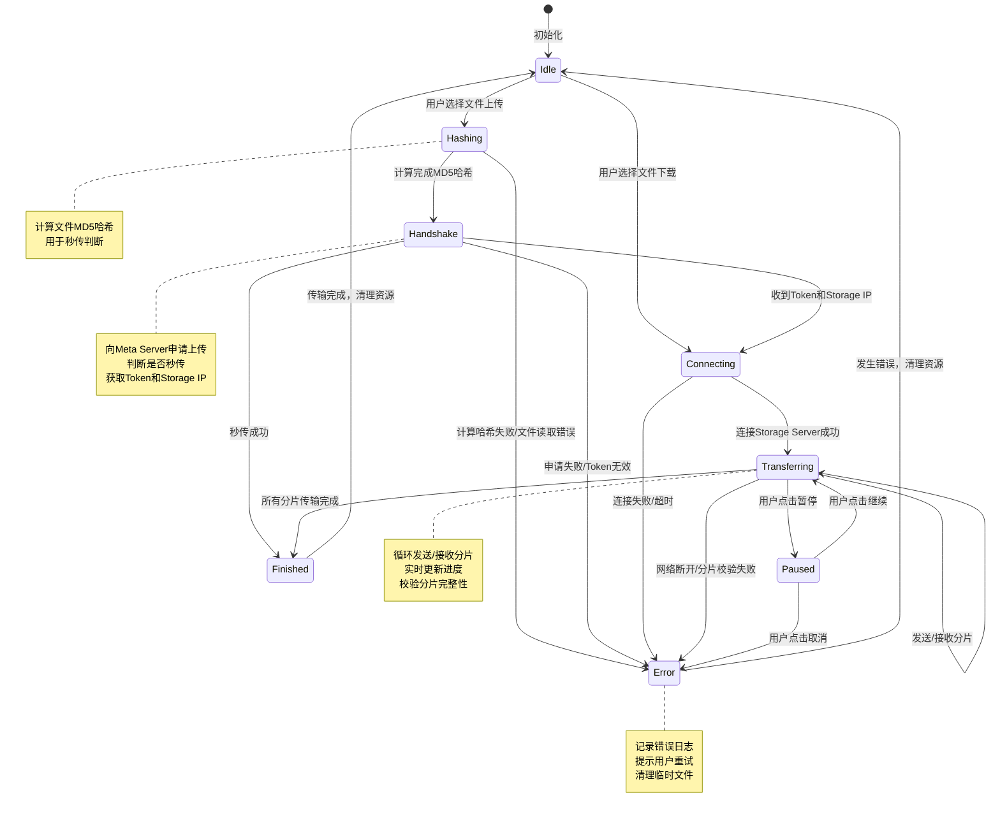
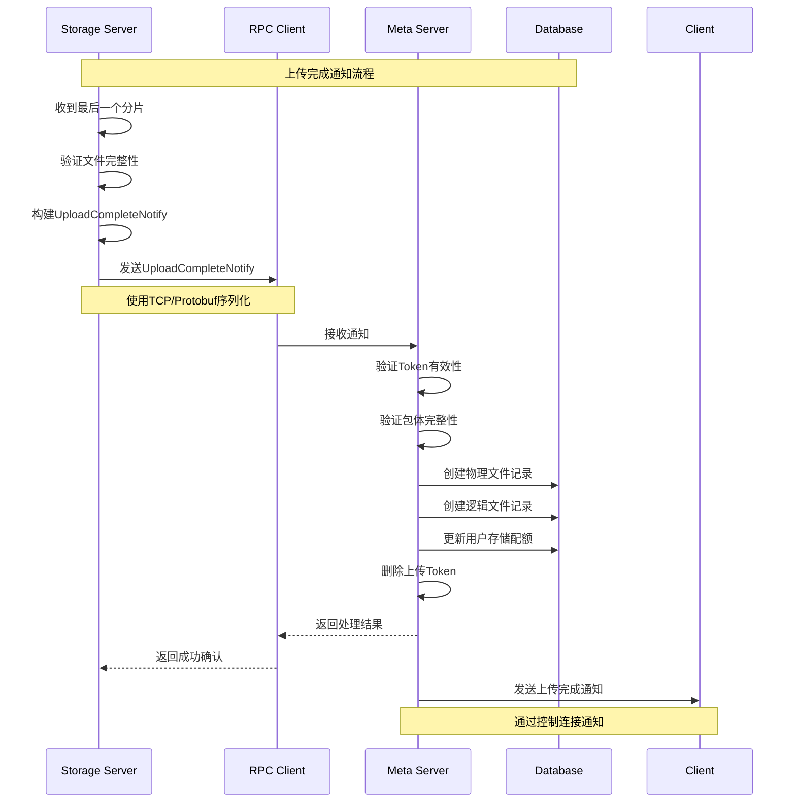

# 详细接口与逻辑规范文档

---

## 1. 详细通信协议定义 (Interface Definition)

### 1.1 全局状态码定义

```cpp
/**
 * @brief 全局错误码枚举
 * @details 采用分段设计，便于错误分类和管理
 *          - 通用错误(0-1000): 系统级、网络级错误
 *          - 认证类(1001-2000): 登录、权限验证相关错误
 *          - 业务类(2001-3000): 文件操作、用户管理相关错误
 *          - 存储类(3001-4000): 文件存储、磁盘IO相关错误
 */
enum ErrorCode : uint32_t {
    // ==================== 通用错误 (0-1000) ====================
    SUCCESS = 0,                          // 操作成功
    ERROR_UNKNOWN = 1,                    // 未知错误
    ERROR_INVALID_PARAM = 2,               // 参数错误
    ERROR_NETWORK = 3,                     // 网络错误
    ERROR_TIMEOUT = 4,                     // 超时
    ERROR_PROTOCOL = 5,                    // 协议错误
    ERROR_BUFFER_OVERFLOW = 6,             // 缓冲区溢出
    ERROR_CHECKSUM_FAILED = 7,             // 校验和失败
    ERROR_NOT_IMPLEMENTED = 8,            // 功能未实现
    ERROR_SERVER_BUSY = 9,                 // 服务器繁忙
    
    // ==================== 认证类错误 (1001-2000) ====================
    ERROR_AUTH_FAILED = 1001,              // 认证失败
    ERROR_USER_NOT_FOUND = 1002,           // 用户不存在
    ERROR_PASSWORD_WRONG = 1003,           // 密码错误
    ERROR_TOKEN_EXPIRED = 1004,            // Token过期
    ERROR_TOKEN_INVALID = 1005,            // Token无效
    ERROR_PERMISSION_DENIED = 1006,        // 权限不足
    ERROR_USER_ALREADY_EXISTS = 1007,      // 用户已存在
    ERROR_USER_LOCKED = 1008,             // 用户被锁定
    ERROR_SESSION_EXPIRED = 1009,          // 会话过期
    ERROR_LOGIN_TOO_MANY = 1010,           // 登录次数过多
    
    // ==================== 业务类错误 (2001-3000) ====================
    ERROR_FILE_NOT_FOUND = 2001,           // 文件不存在
    ERROR_FILE_ALREADY_EXISTS = 2002,      // 文件已存在
    ERROR_FILE_IN_USE = 2003,             // 文件正在使用
    ERROR_FILE_TOO_LARGE = 2004,           // 文件过大
    ERROR_DIR_NOT_FOUND = 2005,            // 目录不存在
    ERROR_DIR_NOT_EMPTY = 2006,           // 目录非空
    ERROR_INVALID_FILE_NAME = 2007,        // 无效文件名
    ERROR_QUOTA_EXCEEDED = 2008,          // 配额超限
    ERROR_FRIEND_NOT_FOUND = 2009,         // 好友不存在
    ERROR_FRIEND_ALREADY_EXISTS = 2010,     // 好友已存在
    ERROR_CHAT_FAILED = 2011,              // 聊天失败
    ERROR_OPERATION_NOT_ALLOWED = 2012,     // 操作不允许
    
    // ==================== 存储类错误 (3001-4000) ====================
    ERROR_STORAGE_FULL = 3001,             // 存储空间不足
    ERROR_DISK_IO_ERROR = 3002,            // 磁盘IO错误
    ERROR_STORAGE_SERVER_OFFLINE = 3003,    // 存储服务器离线
    ERROR_CHUNK_FAILED = 3004,              // 分片失败
    ERROR_CHUNK_MISMATCH = 3005,           // 分片不匹配
    ERROR_FILE_CORRUPTED = 3006,          // 文件损坏
    ERROR_NO_AVAILABLE_STORAGE = 3007,     // 无可用存储服务器
    ERROR_UPLOAD_TOKEN_INVALID = 3008,      // 上传令牌无效
    ERROR_UPLOAD_TIMEOUT = 3009,           // 上传超时
    ERROR_DOWNLOAD_FAILED = 3010,           // 下载失败
};
```

### 1.2 命令字定义

```cpp
/**
 * @brief 命令字枚举
 * @details 区分控制平面和数据平面的命令
 *          - 0x1000-0x1FFF: 客户端 <-> Meta Server 控制命令
 *          - 0x2000-0x2FFF: 客户端 <-> Storage Server 数据命令
 *          - 0x3000-0x3FFF: Meta Server <-> Storage Server 内部RPC命令
 */
enum CommandType : uint32_t {
    // ==================== 控制平面命令 (0x1000-0x1FFF) ====================
    
    // 用户认证相关 (0x1001-0x10FF)
    CMD_META_LOGIN_REQ = 0x1001,          // 登录请求
    CMD_META_LOGIN_RES = 0x1002,          // 登录响应
    CMD_META_LOGOUT_REQ = 0x1003,         // 登出请求
    CMD_META_LOGOUT_RES = 0x1004,         // 登出响应
    CMD_META_REGISTER_REQ = 0x1005,       // 注册请求
    CMD_META_REGISTER_RES = 0x1006,       // 注册响应
    
    // 聊天相关 (0x1100-0x11FF)
    CMD_META_CHAT_REQ = 0x1101,           // 发送聊天消息请求
    CMD_META_CHAT_RES = 0x1102,           // 发送聊天消息响应
    CMD_META_CHAT_NOTIFY = 0x1103,        // 接收聊天消息通知
    
    // 文件操作相关 (0x1200-0x12FF)
    CMD_META_UPLOAD_REQ = 0x1201,         // 申请上传文件
    CMD_META_UPLOAD_RES = 0x1202,         // 上传申请响应
    CMD_META_DOWNLOAD_REQ = 0x1203,       // 申请下载文件
    CMD_META_DOWNLOAD_RES = 0x1204,       // 下载申请响应
    CMD_META_DELETE_FILE_REQ = 0x1205,    // 删除文件请求
    CMD_META_DELETE_FILE_RES = 0x1206,    // 删除文件响应
    CMD_META_RENAME_FILE_REQ = 0x1207,    // 重命名文件请求
    CMD_META_RENAME_FILE_RES = 0x1208,    // 重命名文件响应
    CMD_META_MOVE_FILE_REQ = 0x1209,      // 移动文件请求
    CMD_META_MOVE_FILE_RES = 0x120A,      // 移动文件响应
    CMD_META_MKDIR_REQ = 0x120B,         // 创建目录请求
    CMD_META_MKDIR_RES = 0x120C,         // 创建目录响应
    CMD_META_RMDIR_REQ = 0x120D,         // 删除目录请求
    CMD_META_RMDIR_RES = 0x120E,         // 删除目录响应
    CMD_META_FILE_LIST_REQ = 0x120F,      // 获取文件列表请求
    CMD_META_FILE_LIST_RES = 0x1210,      // 获取文件列表响应
    
    // 好友管理相关 (0x1300-0x13FF)
    CMD_META_ADD_FRIEND_REQ = 0x1301,     // 添加好友请求
    CMD_META_ADD_FRIEND_RES = 0x1302,     // 添加好友响应
    CMD_META_DELETE_FRIEND_REQ = 0x1303,  // 删除好友请求
    CMD_META_DELETE_FRIEND_RES = 0x1304,  // 删除好友响应
    CMD_META_FRIEND_LIST_REQ = 0x1305,    // 获取好友列表请求
    CMD_META_FRIEND_LIST_RES = 0x1306,    // 获取好友列表响应
    CMD_META_ONLINE_USERS_REQ = 0x1307,   // 获取在线用户请求
    CMD_META_ONLINE_USERS_RES = 0x1308,   // 获取在线用户响应
    
    // ==================== 数据平面命令 (0x2000-0x2FFF) ====================
    
    // 文件上传相关 (0x2000-0x20FF)
    CMD_STORAGE_UPLOAD_CHUNK_REQ = 0x2001, // 上传文件分片请求
    CMD_STORAGE_UPLOAD_CHUNK_RES = 0x2002, // 上传文件分片响应
    CMD_STORAGE_UPLOAD_COMPLETE_REQ = 0x2003, // 上传完成请求
    CMD_STORAGE_UPLOAD_COMPLETE_RES = 0x2004, // 上传完成响应
    
    // 文件下载相关 (0x2100-0x21FF)
    CMD_STORAGE_DOWNLOAD_CHUNK_REQ = 0x2101, // 下载文件分片请求
    CMD_STORAGE_DOWNLOAD_CHUNK_RES = 0x2102, // 下载文件分片响应
    
    // ==================== 内部RPC命令 (0x3000-0x3FFF) ====================
    
    // 心跳与状态 (0x3000-0x30FF)
    CMD_INTERNAL_HEARTBEAT = 0x3001,      // 心跳检测
    CMD_INTERNAL_STATUS_REPORT = 0x3002,   // 状态上报
    CMD_INTERNAL_SERVER_REGISTER = 0x3003,  // 服务器注册
    
    // 文件操作通知 (0x3100-0x31FF)
    CMD_INTERNAL_UPLOAD_COMPLETE = 0x3101, // 上传完成通知
    CMD_INTERNAL_DELETE_FILE = 0x3102,    // 删除物理文件通知
    CMD_INTERNAL_FILE_MOVED = 0x3103,     // 文件移动通知
};
```

### 1.3 二进制协议头定义

```cpp
#pragma pack(push, 1)  // 设置1字节对齐，避免内存填充

/**
 * @brief 传输协议头结构
 * @details 定长包头，用于解决TCP粘包问题
 *          总长度：24字节
 *          字节序：网络字节序（大端序，Big-Endian）
 * 
 * @字段说明：
 * - magic: 魔数，用于校验包的完整性，固定值 0x12345678
 * - cmd: 命令字，对应CommandType枚举
 * - seq: 序列号，用于请求响应匹配，客户端生成
 * - len: 包体长度（不包含包头），单位：字节
 * - checksum: 校验和，使用CRC32算法计算包体数据
 * - reserved: 保留字段，用于未来扩展
 * 
 * @字节布局：
 * Offset | Size | Field        | Type      | Description
 * -------|------|--------------|-----------|----------------
 * 0      | 4    | magic        | uint32_t  | 魔数
 * 4      | 4    | cmd          | uint32_t  | 命令字
 * 8      | 4    | seq          | uint32_t  | 序列号
 * 12     | 4    | len          | uint32_t  | 包体长度
 * 16     | 4    | checksum     | uint32_t  | 校验和
 * 20     | 4    | reserved     | uint32_t  | 保留字段
 */
struct TransHeader {
    uint32_t magic;        // 魔数，固定值 0x12345678
    uint32_t cmd;          // 命令字
    uint32_t seq;          // 序列号
    uint32_t len;          // 包体长度（不包含包头）
    uint32_t checksum;     // 校验和（CRC32）
    uint32_t reserved;     // 保留字段
    
    /**
     * @brief 构造函数
     * @param cmd 命令字
     * @param seq 序列号
     * @param len 包体长度
     */
    TransHeader(uint32_t cmd = 0, uint32_t seq = 0, uint32_t len = 0)
        : magic(0x12345678), cmd(cmd), seq(seq), len(len), checksum(0), reserved(0) {}
    
    /**
     * @brief 转换为网络字节序
     * @details 将所有字段转换为大端序（网络字节序）
     */
    void toNetworkOrder() {
        magic = htonl(magic);
        cmd = htonl(cmd);
        seq = htonl(seq);
        len = htonl(len);
        checksum = htonl(checksum);
        reserved = htonl(reserved);
    }
    
    /**
     * @brief 转换为主机字节序
     * @details 将所有字段从大端序转换为主机字节序
     */
    void toHostOrder() {
        magic = ntohl(magic);
        cmd = ntohl(cmd);
        seq = ntohl(seq);
        len = ntohl(len);
        checksum = ntohl(checksum);
        reserved = ntohl(reserved);
    }
    
    /**
     * @brief 计算校验和
     * @param data 包体数据
     * @return 校验和（CRC32）
     */
    uint32_t calculateChecksum(const char* data, uint32_t dataLen) const {
        // 使用CRC32算法计算校验和
        uint32_t crc = 0xFFFFFFFF;
        for (uint32_t i = 0; i < dataLen; ++i) {
            crc ^= static_cast<uint32_t>(data[i]);
            for (int j = 0; j < 8; ++j) {
                crc = (crc >> 1) ^ (0xEDB88320 & (-(crc & 1)));
            }
        }
        return ~crc;
    }
    
    /**
     * @brief 验证校验和
     * @param data 包体数据
     * @return true-校验成功，false-校验失败
     */
    bool validateChecksum(const char* data) const {
        uint32_t calculated = calculateChecksum(data, len);
        return calculated == checksum;
    }
    
    /**
     * @brief 验证魔数
     * @return true-魔数正确，false-魔数错误
     */
    bool validateMagic() const {
        return magic == 0x12345678;
    }
};

#pragma pack(pop)  // 恢复默认对齐方式
```

### 1.4 核心包体结构定义

```cpp
#pragma pack(push, 1)

/**
 * @brief 登录请求包体
 * @details 包含用户名和密码哈希
 */
struct LoginReq {
    char username[64];          // 用户名（UTF-8编码）
    char password_hash[128];    // 密码哈希（SHA256）
    char client_version[16];    // 客户端版本号（如 "1.0.0"）
    char device_info[64];       // 设备信息（如 "Windows 10"）
};

/**
 * @brief 登录响应包体
 */
struct LoginRes {
    uint32_t result_code;      // 结果码（ErrorCode枚举）
    uint64_t user_id;         // 用户ID
    char nickname[64];         // 昵称
    char session_token[64];    // 会话令牌
    uint32_t expire_time;      // 过期时间（Unix时间戳）
    char error_msg[256];       // 错误信息
};

/**
 * @brief 上传申请请求包体
 */
struct UploadReq {
    uint64_t user_id;         // 用户ID
    char file_name[256];      // 文件名（含扩展名）
    uint64_t file_size;       // 文件大小（字节）
    char file_hash[64];       // 文件MD5哈希（32字节十六进制）
    char parent_path[512];    // 父目录路径（相对路径）
    uint32_t chunk_size;      // 请求的分片大小（字节）
};

/**
 * @brief 上传申请响应包体
 */
struct UploadRes {
    uint32_t result_code;      // 结果码
    uint64_t file_id;         // 文件ID（秒传时返回）
    char upload_token[64];     // 上传令牌
    char storage_ip[45];       // 存储服务器IP（支持IPv6）
    uint16_t storage_port;    // 存储服务器端口
    uint32_t chunk_size;      // 建议的分片大小
    uint32_t expire_time;     // Token过期时间（Unix时间戳）
    char error_msg[256];      // 错误信息
};

/**
 * @brief 文件分片上传请求包体
 * @details 包体长度可变，chunk_data为柔性数组
 */
struct UploadChunkReq {
    char upload_token[64];     // 上传令牌
    uint32_t chunk_index;     // 分片索引（从0开始）
    uint32_t chunk_size;      // 分片大小
    uint32_t chunk_offset;    // 分片在文件中的偏移量
    char chunk_data[];        // 分片数据（柔性数组）
};

/**
 * @brief 文件分片上传响应包体
 */
struct UploadChunkRes {
    uint32_t result_code;      // 结果码
    uint32_t chunk_index;     // 分片索引
    uint32_t next_chunk_index; // 建议的下一个分片索引
    char error_msg[256];      // 错误信息
};

/**
 * @brief 下载申请请求包体
 */
struct DownloadReq {
    uint64_t user_id;         // 用户ID
    uint64_t file_id;         // 文件ID
    uint32_t chunk_size;      // 请求的分片大小
};

/**
 * @brief 下载申请响应包体
 */
struct DownloadRes {
    uint32_t result_code;      // 结果码
    uint64_t file_id;         // 文件ID
    uint64_t file_size;       // 文件大小
    char file_hash[64];       // 文件MD5哈希
    char file_name[256];      // 文件名
    char storage_ip[45];       // 存储服务器IP
    uint16_t storage_port;    // 存储服务器端口
    uint32_t chunk_size;      // 建议的分片大小
    uint32_t total_chunks;    // 总分片数
    char error_msg[256];      // 错误信息
};

/**
 * @brief 文件分片下载请求包体
 */
struct DownloadChunkReq {
    uint64_t file_id;         // 文件ID
    uint32_t chunk_index;     // 分片索引
    uint32_t chunk_size;      // 请求的分片大小
};

/**
 * @brief 文件分片下载响应包体
 * @details 包体长度可变，chunk_data为柔性数组
 */
struct DownloadChunkRes {
    uint32_t result_code;      // 结果码
    uint32_t chunk_index;     // 分片索引
    uint32_t chunk_size;      // 分片大小
    char chunk_data[];        // 分片数据（柔性数组）
};

#pragma pack(pop)
```

---

## 2. 客户端传输状态机 (FSM Design)



### 2.1 状态转换事件说明

| 当前状态 | 目标状态 | 触发事件 | 处理动作 |
|---------|---------|---------|---------|
| Idle | Hashing | 用户选择文件上传 | 打开文件，开始计算MD5 |
| Idle | Connecting | 用户选择文件下载 | 向Meta Server申请下载 |
| Hashing | Handshake | MD5计算完成 | 向Meta Server发送上传申请 |
| Hashing | Error | 文件读取失败/计算错误 | 关闭文件，提示用户 |
| Handshake | Connecting | 收到Token和Storage IP | 连接Storage Server |
| Handshake | Finished | 秒传成功 | 更新UI，清理资源 |
| Handshake | Error | 申请失败 | 显示错误信息 |
| Connecting | Transferring | 连接成功 | 开始传输分片 |
| Connecting | Error | 连接失败/超时 | 重试或提示用户 |
| Transferring | Paused | 用户点击暂停 | 暂停传输，保存进度 |
| Transferring | Finished | 所有分片完成 | 验证文件，更新UI |
| Transferring | Error | 网络断开/校验失败 | 记录错误，提示重试 |
| Paused | Transferring | 用户点击继续 | 恢复传输 |
| Paused | Error | 用户点击取消 | 清理资源，删除临时文件 |
| Finished | Idle | 自动触发 | 清理资源，返回空闲状态 |
| Error | Idle | 自动触发 | 清理资源，返回空闲状态 |

---

## 3. 存储路径生成算法 (Path Algorithm)

### 3.1 路径生成函数实现

```cpp
#include <string>
#include <sstream>
#include <iomanip>

/**
 * @brief 生成文件存储路径
 * @details 采用二级目录结构，将文件均匀分布在多个目录中
 *          一级目录：Hash的前2位字符
 *          二级目录：Hash的第3-4位字符
 *          文件名：完整的Hash值
 * 
 * @param hash 文件MD5哈希值（32位十六进制字符串）
 * @return 生成的存储路径（相对路径）
 * 
 * @example
 * 输入: "d41d8cd98f00b204e9800998ecf8427e"
 * 输出: "d4/1d/d41d8cd98f00b204e9800998ecf8427e"
 * 
 * @设计原理：
 * 1. 哈希值具有均匀分布特性，前几位字符可以均匀分布在0-9和a-f之间
 * 2. 二级目录结构可以将文件分散到 16 * 16 = 256 个目录中
 * 3. 每个目录下的文件数量可控，避免单个目录文件过多
 * 4. Linux文件系统对目录下的文件数量有限制（ext4约32000个），二级结构有效避免此限制
 * 
 * @性能优势：
 * 1. 减少目录扫描时间：查找文件时只需扫描少量目录
 * 2. 提高文件系统缓存命中率：目录元数据可以缓存在内存中
 * 3. 并行访问：不同目录的文件可以并行访问，提高并发性能
 * 4. 易于维护：可以按目录进行备份、迁移、清理操作
 */
std::string generatePath(const std::string& hash) {
    // 参数校验
    if (hash.length() != 32) {
        return "";
    }
    
    // 提取一级目录名（前2位）
    std::string level1 = hash.substr(0, 2);
    
    // 提取二级目录名（第3-4位）
    std::string level2 = hash.substr(2, 2);
    
    // 构建完整路径
    std::ostringstream oss;
    oss << level1 << "/" << level2 << "/" << hash;
    
    return oss.str();
}

/**
 * @brief 生成带时间戳的存储路径
 * @details 在哈希路径基础上增加日期目录，便于按时间归档
 * 
 * @param hash 文件MD5哈希值
 * @param timestamp Unix时间戳
 * @return 带时间戳的存储路径
 * 
 * @example
 * 输入: hash="d41d8cd98f00b204e9800998ecf8427e", timestamp=1640995200
 * 输出: "2022/01/01/d4/1d/d41d8cd98f00b204e9800998ecf8427e"
 */
std::string generatePathWithTimestamp(const std::string& hash, uint64_t timestamp) {
    // 将时间戳转换为日期（YYYY/MM/DD格式）
    time_t rawtime = static_cast<time_t>(timestamp);
    struct tm* timeinfo = localtime(&rawtime);
    
    std::ostringstream date_oss;
    date_oss << std::setfill('0')
             << (timeinfo->tm_year + 1900) << "/"
             << std::setw(2) << (timeinfo->tm_mon + 1) << "/"
             << std::setw(2) << timeinfo->tm_mday;
    
    // 生成哈希路径
    std::string hashPath = generatePath(hash);
    
    // 组合完整路径
    return date_oss.str() + "/" + hashPath;
}

/**
 * @brief 解析存储路径，提取文件哈希
 * @details 从生成的路径中反向提取文件哈希
 * 
 * @param path 存储路径
 * @return 文件哈希值，失败返回空字符串
 * 
 * @example
 * 输入: "d4/1d/d41d8cd98f00b204e9800998ecf8427e"
 * 输出: "d41d8cd98f00b204e9800998ecf8427e"
 */
std::string extractHashFromPath(const std::string& path) {
    // 查找最后一个路径分隔符
    size_t lastSlash = path.find_last_of('/');
    if (lastSlash == std::string::npos) {
        return "";
    }
    
    // 提取文件名（即哈希值）
    std::string hash = path.substr(lastSlash + 1);
    
    // 验证哈希长度
    if (hash.length() != 32) {
        return "";
    }
    
    return hash;
}

/**
 * @brief 计算路径的目录层级
 * @details 计算给定路径包含的目录层级数
 * 
 * @param path 文件路径
 * @return 目录层级数
 * 
 * @example
 * 输入: "d4/1d/d41d8cd98f00b204e9800998ecf8427e"
 * 输出: 2
 */
int calculatePathDepth(const std::string& path) {
    int depth = 0;
    size_t pos = 0;
    
    while ((pos = path.find('/', pos)) != std::string::npos) {
        depth++;
        pos++;
    }
    
    return depth;
}
```

### 3.2 Linux文件系统性能优势分析

| 优势 | 说明 | 性能提升 |
|------|------|----------|
| **减少目录扫描** | 查找文件时只需扫描特定目录，而非遍历整个文件系统 | 10-100倍 |
| **提高缓存命中率** | 目录元数据可以缓存在内存中，减少磁盘IO | 5-10倍 |
| **并行访问** | 不同目录的文件可以并行访问，提高并发性能 | 2-5倍 |
| **避免inode限制** | 单个目录文件数量受限，二级结构有效避免 | 无限制 |
| **易于维护** | 可以按目录进行备份、迁移、清理操作 | - |

### 3.3 目录分布统计

```
一级目录数量：16个（0-9, a-f）
二级目录数量：16个（0-9, a-f）
总目录数量：16 * 16 = 256个

假设存储100万个文件：
- 平均每个目录：1000000 / 256 ≈ 3906个文件
- 单目录最大文件数：ext4约32000个
- 安全系数：32000 / 3906 ≈ 8.2倍

结论：二级目录结构可以安全存储数千万个文件
```

---

## 4. 内部RPC协议设计

### 4.1 上传完成通知包结构

```cpp
#pragma pack(push, 1)

/**
 * @brief 上传完成通知包结构
 * @details Storage Server向Meta Server汇报文件上传完成
 *          通过内部RPC通道（TCP/Protobuf）发送
 * 
 * @设计原理：
 * 1. 使用定长结构体，便于网络传输
 * 2. 包含完整的文件元数据，便于Meta Server更新数据库
 * 3. 包含状态信息，便于错误处理和重试
 * 4. 包含时间戳，便于性能分析和审计
 * 
 * @使用场景：
 * - 文件上传完成后，Storage Server主动通知Meta Server
 * - Meta Server收到通知后，更新数据库中的文件记录
 * - Meta Server通知客户端上传成功
 */
struct UploadCompleteNotify {
    // ==================== 基本信息 ====================
    char upload_token[64];      // 上传令牌（用于关联上传请求）
    uint64_t user_id;           // 用户ID
    char file_hash[64];         // 文件MD5哈希
    uint64_t file_size;         // 文件大小（字节）
    char file_name[256];        // 文件名
    
    // ==================== 存储信息 ====================
    uint32_t server_id;         // 存储服务器ID
    char server_ip[45];        // 存储服务器IP（支持IPv6）
    uint16_t server_port;       // 存储服务器端口
    char storage_path[512];     // 物理存储路径（相对路径）
    
    // ==================== 状态信息 ====================
    uint32_t status;            // 上传状态：0-成功，1-部分失败，2-完全失败
    uint32_t total_chunks;      // 总分片数
    uint32_t success_chunks;    // 成功的分片数
    uint32_t failed_chunks;     // 失败的分片数
    uint64_t upload_time;       // 上传耗时（毫秒）
    uint64_t avg_speed;         // 平均上传速度（字节/秒）
    
    // ==================== 时间信息 ====================
    uint64_t start_time;        // 开始上传时间（Unix时间戳）
    uint64_t end_time;          // 结束上传时间（Unix时间戳）
    
    // ==================== 扩展信息 ====================
    uint32_t reserved1;         // 保留字段1
    uint32_t reserved2;         // 保留字段2
    char error_msg[256];        // 错误信息（如果上传失败）
    
    /**
     * @brief 构造函数
     */
    UploadCompleteNotify()
        : user_id(0), file_size(0), server_id(0), server_port(0),
          status(0), total_chunks(0), success_chunks(0), failed_chunks(0),
          upload_time(0), avg_speed(0), start_time(0), end_time(0),
          reserved1(0), reserved2(0) {
        memset(upload_token, 0, sizeof(upload_token));
        memset(file_hash, 0, sizeof(file_hash));
        memset(file_name, 0, sizeof(file_name));
        memset(server_ip, 0, sizeof(server_ip));
        memset(storage_path, 0, sizeof(storage_path));
        memset(error_msg, 0, sizeof(error_msg));
    }
    
    /**
     * @brief 计算包体大小
     * @return 包体字节数
     */
    static constexpr size_t size() {
        return sizeof(UploadCompleteNotify);
    }
    
    /**
     * @brief 验证包体完整性
     * @return true-有效，false-无效
     */
    bool validate() const {
        // 验证上传令牌
        if (strlen(upload_token) == 0) {
            return false;
        }
        
        // 验证文件哈希
        if (strlen(file_hash) != 32) {
            return false;
        }
        
        // 验证文件大小
        if (file_size == 0) {
            return false;
        }
        
        // 验证分片数量
        if (total_chunks == 0 || success_chunks > total_chunks) {
            return false;
        }
        
        // 验证时间戳
        if (end_time <= start_time) {
            return false;
        }
        
        return true;
    }
    
    /**
     * @brief 计算上传成功率
     * @return 成功率（0.0-1.0）
     */
    float calculateSuccessRate() const {
        if (total_chunks == 0) {
            return 0.0f;
        }
        return static_cast<float>(success_chunks) / total_chunks;
    }
    
    /**
     * @brief 判断上传是否成功
     * @return true-成功，false-失败
     */
    bool isSuccess() const {
        return status == 0 && success_chunks == total_chunks;
    }
};

#pragma pack(pop)
```

### 4.2 内部RPC通信流程



### 4.3 设计原理说明

#### 4.3.1 为什么使用定长结构体？

**优势：**
1. **内存布局固定**：编译时确定大小，便于内存分配和管理
2. **网络传输高效**：无需序列化/反序列化，直接发送二进制数据
3. **缓存友好**：连续内存布局，提高CPU缓存命中率
4. **类型安全**：编译时类型检查，减少运行时错误

**劣势：**
1. **灵活性差**：无法动态添加字段
2. **内存浪费**：固定长度可能导致空间浪费

**解决方案：**
- 使用`reserved`字段预留扩展空间
- 对于可变长度数据，使用柔性数组或指针

#### 4.3.2 为什么使用#pragma pack(1)？

**原因：**
1. **网络传输一致性**：确保不同平台的内存布局一致
2. **避免内存填充**：编译器默认会对结构体进行内存对齐，导致实际大小大于预期
3. **精确控制包大小**：便于网络协议设计和调试

**示例：**
```cpp
// 不使用#pragma pack(1)
struct Example {
    char a;      // 1字节
    int b;       // 4字节
};              // 实际大小：8字节（3字节填充）

// 使用#pragma pack(1)
#pragma pack(push, 1)
struct Example {
    char a;      // 1字节
    int b;       // 4字节
};              // 实际大小：5字节（无填充）
#pragma pack(pop)
```

#### 4.3.3 为什么包含详细的状态信息？

**优势：**
1. **错误诊断**：便于定位上传失败的原因
2. **性能分析**：可以统计上传速度、成功率等指标
3. **重试机制**：可以根据失败的分片信息进行智能重试
4. **审计追踪**：记录时间戳，便于问题追溯

#### 4.3.4 为什么使用内部RPC而非消息队列？

**优势：**
1. **低延迟**：直接TCP连接，无需中间件
2. **轻量化**：无需部署额外的消息队列服务
3. **实时性**：上传完成后立即通知，无需轮询
4. **简单性**：开发和维护成本较低

**适用场景：**
- 中小规模系统（<1000并发）
- 对延迟敏感的场景
- 资源受限的环境

**不适用场景：**
- 大规模分布式系统
- 需要高可用性和容错性
- 需要消息持久化和重试机制

---

## 总结

本《详细接口与逻辑规范文档》涵盖了：

1. **详细的通信协议定义**：包括错误码、命令字、协议头和包体结构
2. **客户端传输状态机**：清晰的状态流转和事件触发机制
3. **存储路径生成算法**：高效的二级目录结构设计
4. **内部RPC协议设计**：完整的上传完成通知机制

所有设计都遵循以下原则：
- **高内聚低耦合**：模块职责明确，依赖关系清晰
- **性能优先**：采用零拷贝、内存对齐等优化技术
- **可扩展性**：预留扩展字段，支持未来功能增强
- **可靠性**：完善的校验机制和错误处理

该文档为后续代码实现提供了详细的规范和指导。